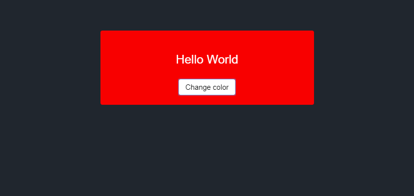

# Teste para desenvolvedores JAVASCRIPT
## Instruções
O teste a seguir é composto de 5 exercícios que iram verificar o nível de proficiênia am JAVASCRIPT, JQUERY, CSS e HTML

Para cada um dos exercícios, você deverá clicar no link abaixo, e alterar o código conforme pedido o exercício.

Ao acabar cada exercício, salvar o código com &lt;ctrl&gt;+&lt;s&gt; e me enviar a URL gerada no barra de endereços.

### Exercício 1:
https://jsfiddle.net/3e6y52qj/3/
#### Resultado esperado

### Exercício 2:
https://jsfiddle.net/c92wq5aj/
#### Resultado esperado

### Exercício 3:
https://jsfiddle.net/aynksu03/
#### Resultado esperado

### Exercicio 4:
https://jsfiddle.net/9pdsu5ey/
#### Resultado esperado

### exercício 5:
https://jsfiddle.net/jvLgm72d/
#### Resultado esperado

