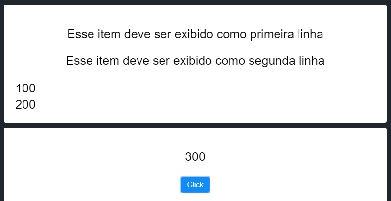
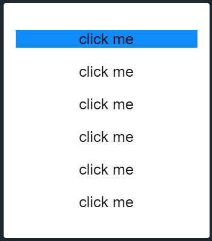

# Teste para desenvolvedores JAVASCRIPT
## Instruções
O teste a seguir é composto de 5 exercícios que irão verificar o nível de proficiênia am JAVASCRIPT, JQUERY, CSS e HTML

Para cada um dos exercícios, você deverá clicar no link abaixo, e alterar o código conforme pedido o exercício.

Ao acabar cada exercício, salvar o código com &lt;ctrl&gt;+&lt;s&gt; e me enviar a URL gerada no barra de endereços.

Todos os exercícios abaixo devem editar o código JS ou o arquivo CSS. Não é necessário editar o arquivo HTML.

### Exercício 1:
https://jsfiddle.net/3e6y52qj/3/

Ao clicar no botão, deverá mostrar o seu nome no lugar reservado para ele.

#### Resultado esperado

### Exercício 2:
https://jsfiddle.net/c92wq5aj/

Ao clicar no botão, deverá adicionar uma classe ao fundo da janela de tal forma que ela fique da cor vermelha.

#### Resultado esperado

### Exercício 3:
https://jsfiddle.net/aynksu03/

Ao clicar no botão, exibir no lugar reservado o somatório dos valores das células da tabela de valores.

Caso o HTML seja alterado, o valor total deverá refletir o novo somatório sem alteração do javascript.

#### Resultado esperado

### Exercicio 4:
https://jsfiddle.net/9pdsu5ey/

Ao clicar no botão, a última linha de texto deverá ser excluída.

#### Resultado esperado

### Exercício 5:
https://jsfiddle.net/7qz82obc/

Ao clicar em cada item adicionar a classe `selected` ao item de tal forma que ele ficará com o fundo azul. ao clicar em outro item, o anterior tem que voltar a ficar sem background.

#### Resultado esperado

